# 캐치캐쉬 관리자 CMS 최종 유저플로우

> 문서 버전: `v1.0`  
> 확정일: `2026-07-26`  
> 적용 범위: 관리자 CMS MVP 및 사용자 앱·발급 백엔드 연계  
> 사용 목적: IA 설계, 메뉴 구조 확정, 화면별 와이어프레임 제작, 화면 전환 정의

---

# 0. 문서 목적

이 문서는 다음 흐름을 하나의 기준으로 연결한다.

```txt
관리자 인증
관리자 계정 관리
대시보드
보물상자와 상품 운영
사용자 앱 지도·AR
보상 ready 생성
사용자 쿠폰 받기
발급 성공·실패
관리자 재처리
사용자 문의와 답변
치팅 의심과 유저 정지
운영 로그
```

---

# 1. 전체 시스템 액터

| 액터 | 설명 |
|---|---|
| super_admin | 전체 운영·위험 액션·계정·로그 관리 |
| operator | 일반 운영 업무 수행 |
| viewer | 목록·상세 조회만 수행 |
| 사용자 | 모바일 앱에서 지도·AR·보상·문의 이용 |
| 발급 백엔드 | 보상 발급 검증 및 기프티쇼비즈 호출 |
| 재처리 Worker | 관리자 재처리 요청 비동기 처리 |
| Supabase | 인증·DB·RPC·Storage·Edge Function |
| 기프티쇼비즈 | 실제 쿠폰 발급 시스템 |

---

# 2. CMS 전체 화면 구조

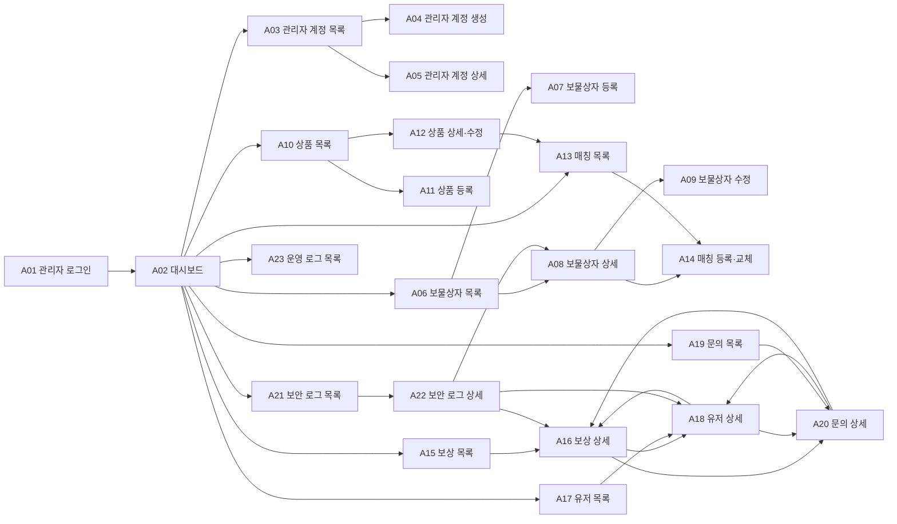

---

# 3. 역할별 메뉴 흐름

## 3.1 super_admin

```txt
대시보드
보물상자
상품
보물-상품 매칭
보상
유저
문의
보안 로그
운영 로그
관리자 계정
```

## 3.2 operator

```txt
대시보드
보물상자
상품
보물-상품 매칭
보상
유저
문의
운영 로그
```

제외:

```txt
보안 로그
관리자 계정
민감 운영 로그
```

## 3.3 viewer

```txt
대시보드
보물상자
상품
보물-상품 매칭
보상
유저
문의
```

viewer는 같은 화면의 조회 전용 버전을 사용한다.

---

# 4. 관리자 로그인 플로우

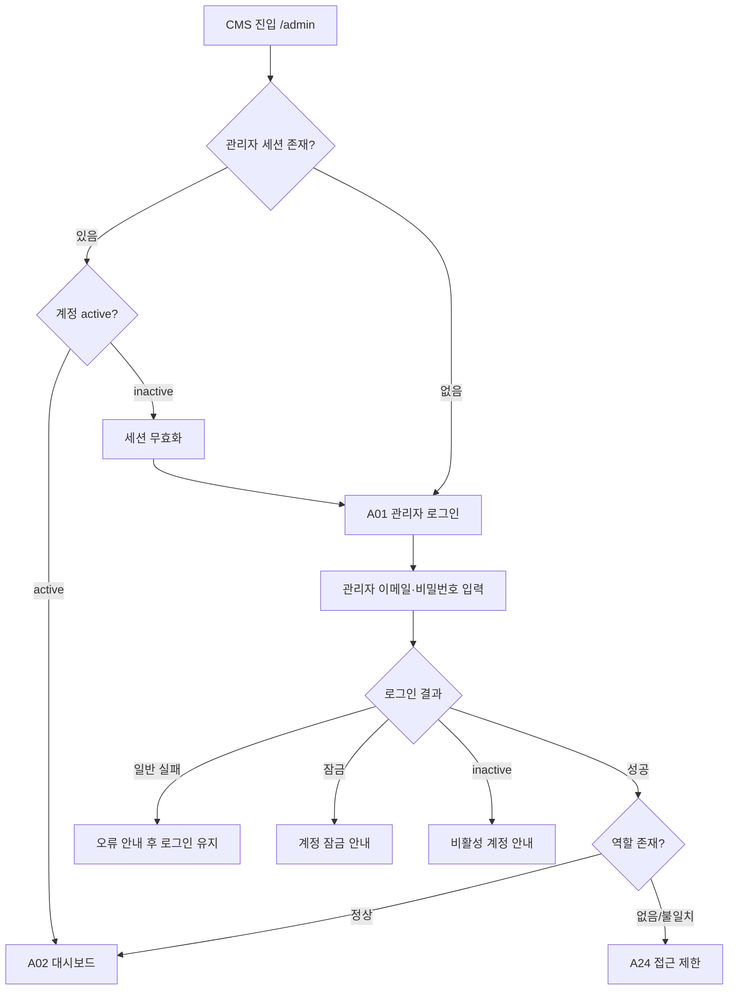

## 4.1 관리자 계정 생성 흐름

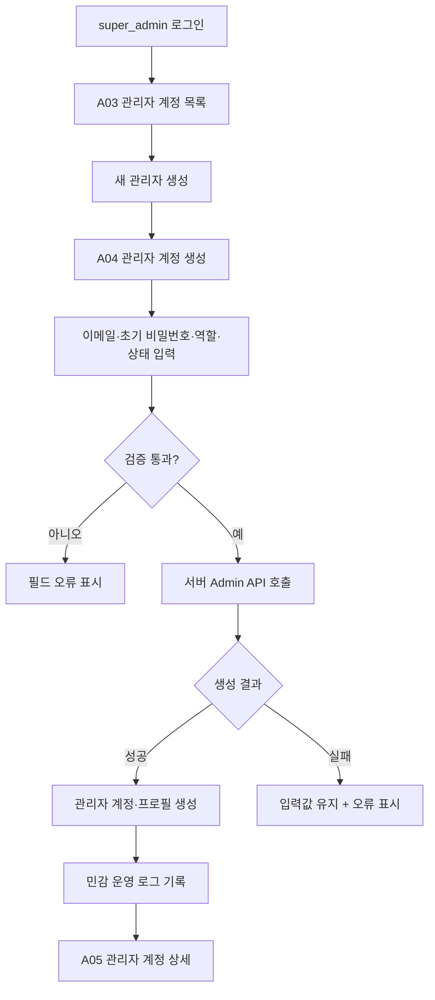

초대 메일·초대 링크 흐름은 없다.

## 4.2 관리자 계정 비활성화

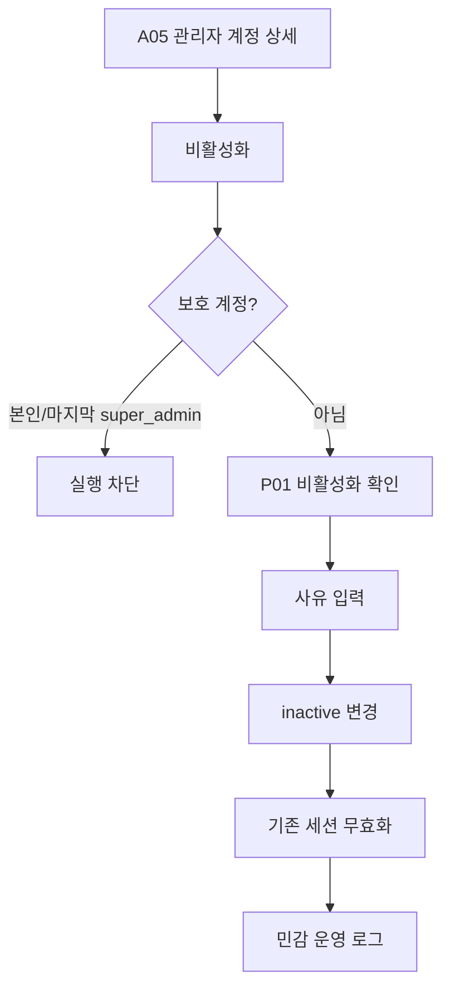

---

# 5. 대시보드 플로우

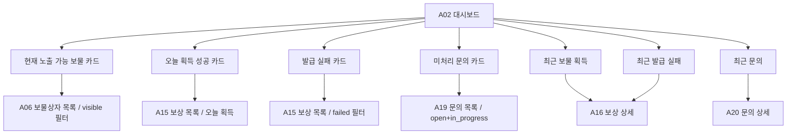

viewer도 같은 운영 현황을 조회할 수 있다.

관리자 작업 이력은 대시보드 최근 활동에 노출하지 않는다.

---

# 6. 보물상자 등록·게시 플로우

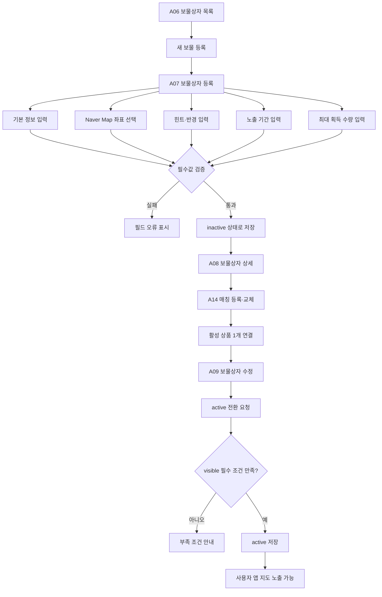

## 6.1 visible 조건

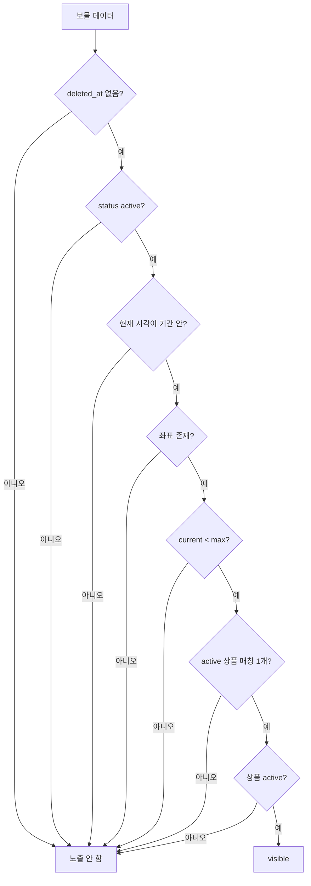

---

# 7. 보물상자 상태 변경 플로우

## 7.1 active/inactive

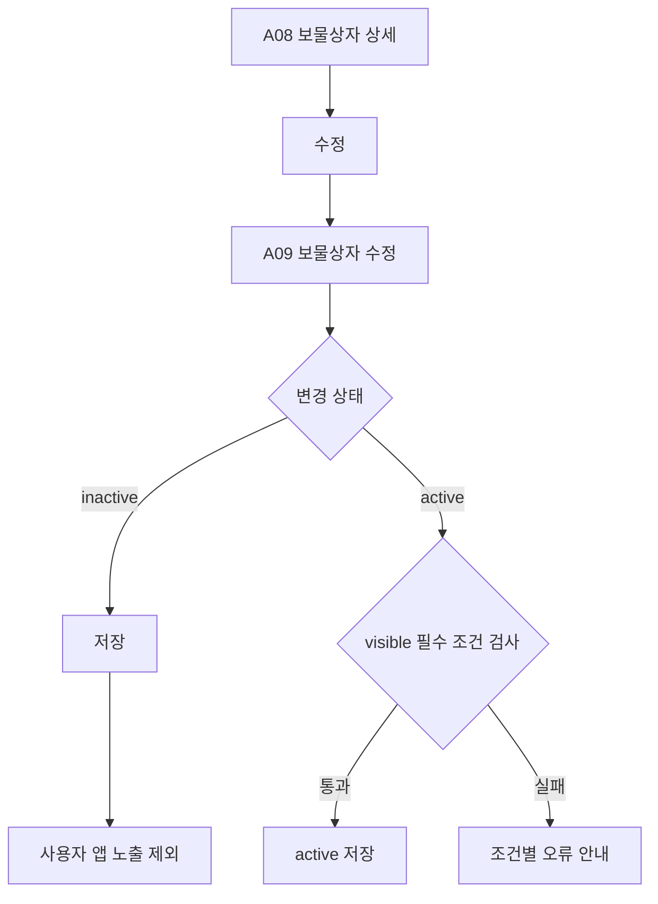

## 7.2 소프트 삭제

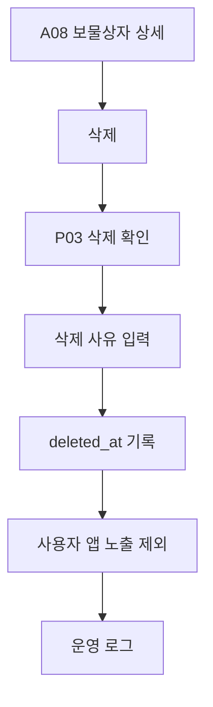

## 7.3 복구

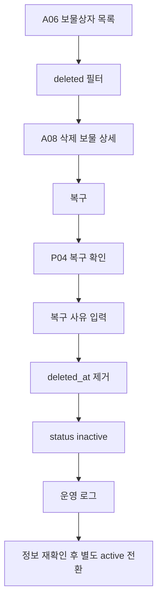

---

# 8. 상품 및 매칭 플로우

## 8.1 상품 등록

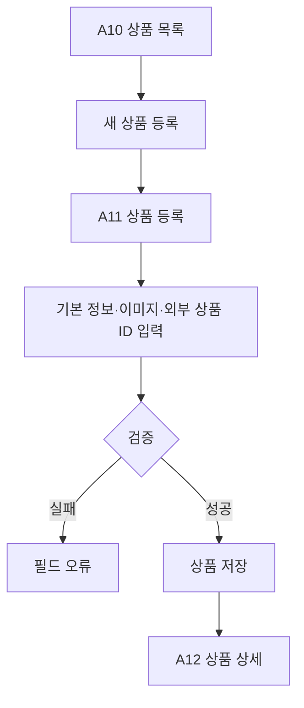

## 8.2 활성 상품 연결

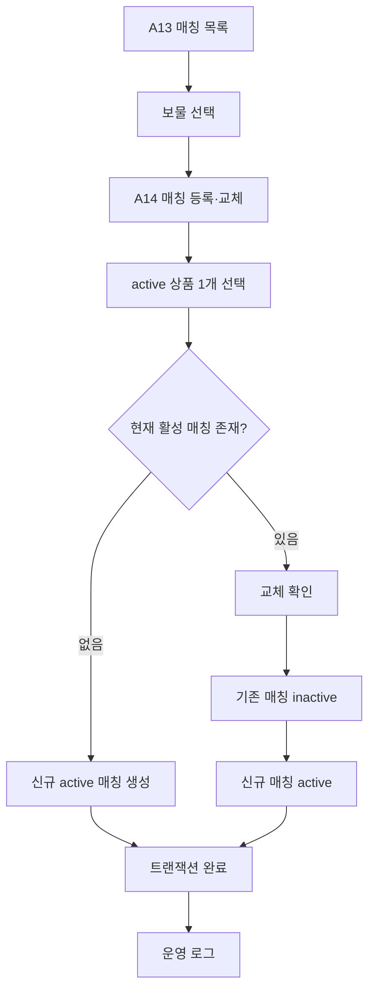

## 8.3 상품 비활성화 영향

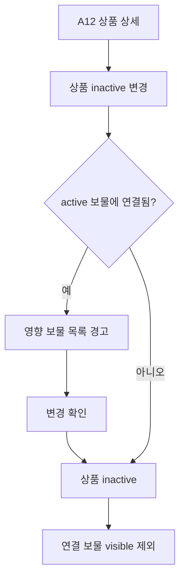

---

# 9. 사용자 앱 지도·AR·보상 연계 플로우

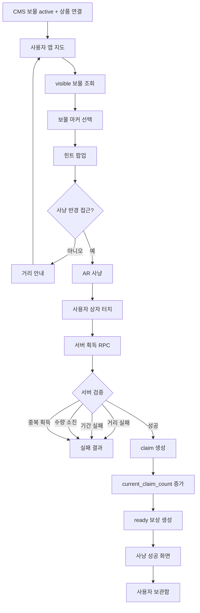

---

# 10. 사용자 쿠폰 받기 플로우

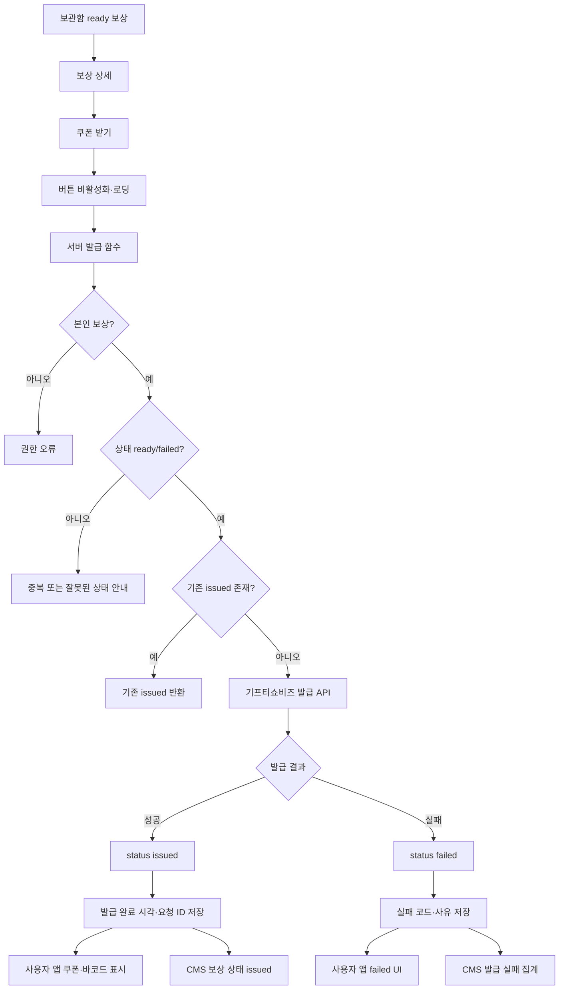

보상 상태에 `processing`을 추가하지 않는다.

발급 중 여부는 서버 Lock과 UI Loading으로 처리한다.

---

# 11. 사용자 실패 재시도와 관리자 재처리 차이

## 11.1 사용자 재시도

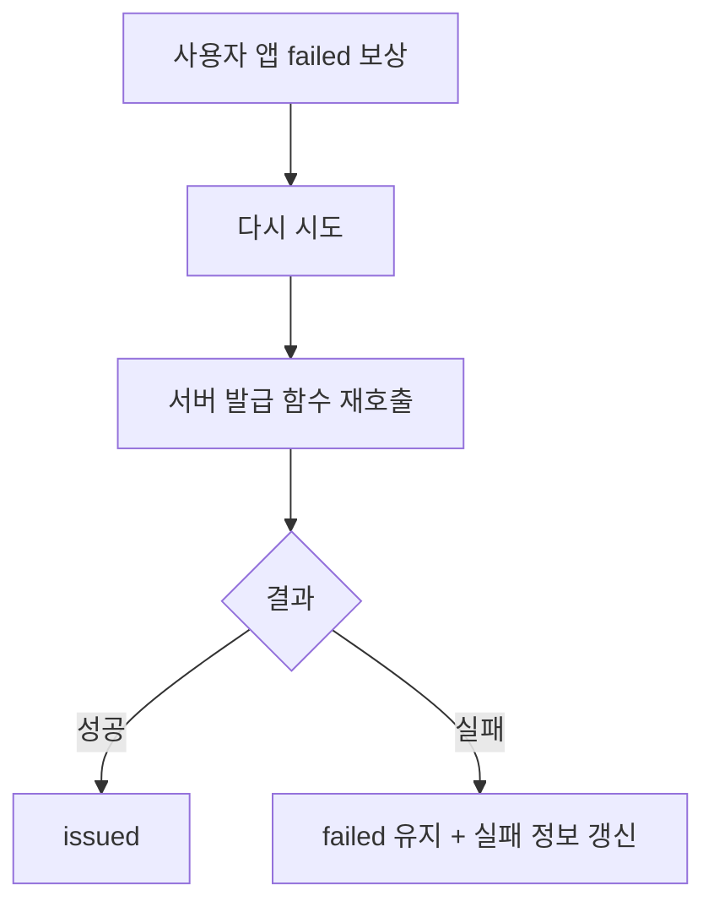

## 11.2 관리자 재처리 요청

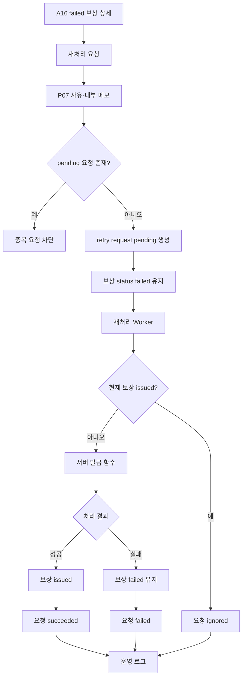

---

# 12. 보상 관리 플로우

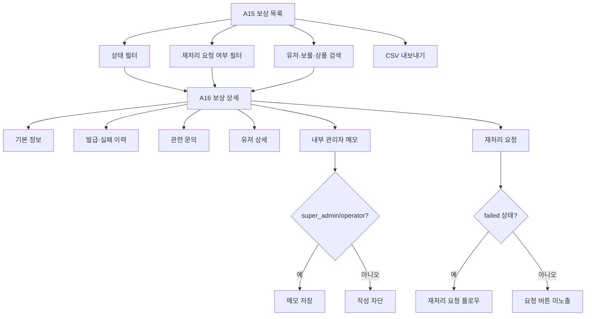

쿠폰 번호와 바코드 조회 흐름은 존재하지 않는다.

---

# 13. 사용자 문의·관리자 답변 플로우

## 13.1 사용자 문의 등록

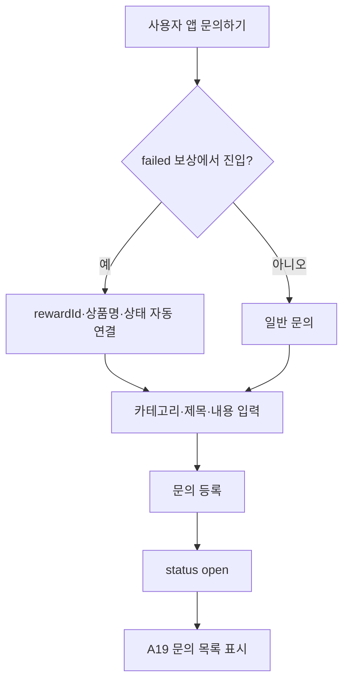

## 13.2 관리자 문의 처리

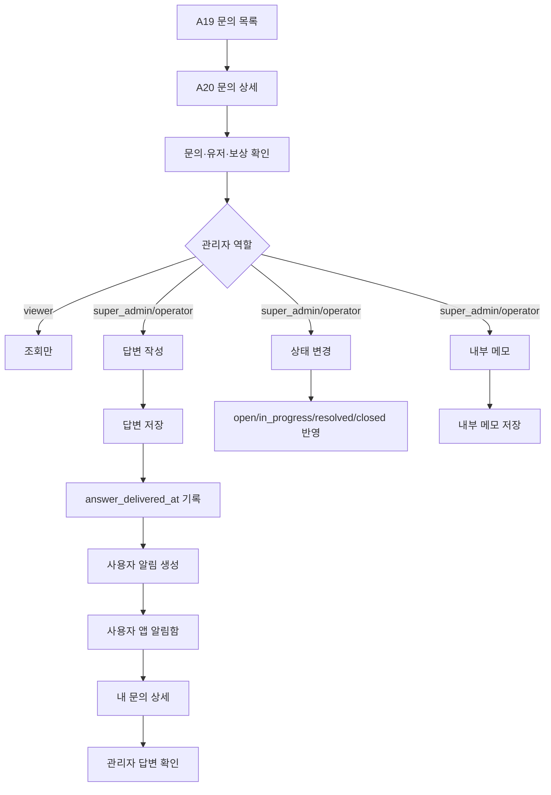

## 13.3 문의 상태 권장 전이

```mermaid
stateDiagram-v2
  [*] --> open
  open --> in_progress
  open --> resolved
  in_progress --> resolved
  resolved --> closed
  resolved --> in_progress: 추가 처리 필요
  closed --> in_progress: 재오픈
```

---

# 14. 유저 관리 플로우

```mermaid
flowchart TD
  A["A17 유저 목록"] --> B["닉네임·ID·상태 검색"]
  B --> C["A18 유저 상세"]

  C --> D["보상 내역"]
  C --> E["문의 내역"]
  C --> F["보안 로그: super_admin만"]
  C --> G["내부 메모: super_admin/operator"]

  C --> H{"super_admin?"}
  H -->|아니오| I["상태 조회만"]
  H -->|예| J{"현재 상태"}

  J -->|active| K["유저 정지"]
  J -->|suspended| L["정지 해제"]

  K --> M["P05 사유·근거 확인"]
  M --> N["status suspended"]
  N --> O["민감 운영 로그"]

  L --> P["P06 해제 사유 확인"]
  P --> Q["status active"]
  Q --> O
```

## 14.1 정지 사용자 앱 처리

```mermaid
flowchart TD
  A["사용자 API 요청"] --> B{"profiles.status"}
  B -->|active| C["정상 처리"]
  B -->|suspended| D["핵심 서비스 액션 차단"]
  D --> E["정지 안내 화면"]
  D --> F["AR 획득 차단"]
  D --> G["쿠폰 발급 요청 차단"]
```

---

# 15. 보안 로그·제재 플로우

```mermaid
flowchart TD
  A["사용자 위치·획득 요청"] --> B["서버 검증"]
  B --> C{"이상 조건?"}

  C -->|없음| D["정상 처리"]
  C -->|있음| E["보안 로그 생성"]

  E --> F["A21 보안 로그 목록"]
  F --> G["A22 보안 로그 상세"]

  G --> H["요청 위치·기준 좌표"]
  G --> I["측정 거리·허용 반경"]
  G --> J["GPS 정확도"]
  G --> K["같은 유저 연관 로그"]
  G --> L["같은 보물 연관 로그"]

  K --> M{"제재 근거 충분?"}
  L --> M
  M -->|아니오| N["관찰 유지"]
  M -->|예| O["A18 유저 상세"]
  O --> P["P05 유저 정지 확인"]
  P --> Q["status suspended"]
  Q --> R["민감 운영 로그"]
```

한 건의 거리 초과만으로 자동 정지하지 않는다.

---

# 16. 운영 로그 흐름

```mermaid
flowchart TD
  A["관리자 액션"] --> B{"액션 등급"}

  B -->|민감| C["민감 운영 로그"]
  B -->|일반| D["일반 운영 로그"]

  C --> E["super_admin만 조회"]
  D --> F["super_admin/operator 조회"]

  E --> G["A23 운영 로그 목록"]
  F --> G

  G --> H["액션 유형 필터"]
  G --> I["실행자 필터"]
  G --> J["대상 필터"]
  G --> K["기간 필터"]
```

viewer는 운영 로그 Route와 메뉴에 접근할 수 없다.

---

# 17. 목록 공통 플로우

```mermaid
flowchart TD
  A["목록 진입"] --> B["Query String 조건 복원"]
  B --> C["데이터 로딩"]

  C --> D{"조회 결과"}
  D -->|성공 + 데이터| E["Table 표시"]
  D -->|성공 + 0건| F["빈 상태 또는 검색 결과 없음"]
  D -->|실패| G["조회 실패 + 다시 시도"]

  E --> H["검색·필터·정렬"]
  H --> I["URL Query 갱신"]
  I --> C

  E --> J["상세 진입"]
  J --> K["뒤로가기"]
  K --> B
```

권장 Query 예시:

```txt
/admin/rewards?status=failed&retry=pending&page=2&sort=claimed_at.desc
```

---

# 18. 등록·수정 공통 플로우

```mermaid
flowchart TD
  A["등록 또는 수정 화면"] --> B["폼 입력"]
  B --> C["저장"]
  C --> D{"클라이언트 검증"}

  D -->|실패| E["필드 오류"]
  D -->|통과| F["저장 버튼 비활성화"]
  F --> G["서버 검증·권한 확인"]

  G --> H{"저장 결과"}
  H -->|성공| I["성공 토스트"]
  I --> J["상세 화면 이동"]

  H -->|실패| K["입력값 유지"]
  K --> L["실패 안내·재시도"]
```

## 18.1 미저장 이탈

```mermaid
flowchart TD
  A["폼 변경"] --> B["뒤로가기/메뉴 이동"]
  B --> C{"미저장 변경 있음?"}

  C -->|없음| D["이동"]
  C -->|있음| E["P08 이탈 확인"]
  E -->|계속 작성| F["폼 유지"]
  E -->|나가기| D
```

---

# 19. 권한 부족 플로우

```mermaid
flowchart TD
  A["관리자 화면 또는 API 요청"] --> B["세션 확인"]
  B --> C{"로그인?"}

  C -->|아니오| D["/admin/login"]
  C -->|예| E["역할 확인"]

  E --> F{"Route 권한 있음?"}
  F -->|아니오| G["A24 접근 제한"]
  F -->|예| H["데이터 조회"]

  H --> I{"Action 권한 있음?"}
  I -->|아니오| J["403 + 권한 안내"]
  I -->|예| K["액션 수행"]
```

---

# 20. 와이어프레임 제작 순서

## 20.1 1차 — 구조

```txt
Admin Global Layout
Sidebar
Header
Page Header
Filter Bar
Table
Detail Section
Form Section
Dialog
Toast
Empty/Error State
```

## 20.2 2차 — 핵심 업무

```txt
A01 로그인
A02 대시보드
A06 보물 목록
A07 보물 등록
A08 보물 상세
A09 보물 수정
A10 상품 목록
A11 상품 등록
A12 상품 상세
A13 매칭 목록
A14 매칭 등록·교체
```

## 20.3 3차 — 운영 대응

```txt
A15 보상 목록
A16 보상 상세
A17 유저 목록
A18 유저 상세
A19 문의 목록
A20 문의 상세
```

## 20.4 4차 — 보안·관리

```txt
A21 보안 로그 목록
A22 보안 로그 상세
A23 운영 로그
A03 관리자 계정 목록
A04 관리자 계정 생성
A05 관리자 계정 상세
```

## 20.5 5차 — 공통 팝업과 상태

```txt
P01~P08 팝업
Loading
Empty
Search Empty
Error
Forbidden
Session Expired
```

---

# 21. 화면별 와이어프레임 이후 MD 작성 순서

와이어프레임이 확정되면 다음 파일을 화면별로 작성한다.

```txt
00_Admin_Common_Layout.md
01_Admin_Login.md
02_Admin_Dashboard.md
03_Admin_Account_List.md
04_Admin_Account_Create.md
05_Admin_Account_Detail.md
06_Admin_Treasure_List.md
07_Admin_Treasure_Create.md
08_Admin_Treasure_Detail.md
09_Admin_Treasure_Edit.md
10_Admin_Product_List.md
11_Admin_Product_Create.md
12_Admin_Product_Detail.md
13_Admin_Mapping_List.md
14_Admin_Mapping_Edit.md
15_Admin_Reward_List.md
16_Admin_Reward_Detail.md
17_Admin_User_List.md
18_Admin_User_Detail.md
19_Admin_Inquiry_List.md
20_Admin_Inquiry_Detail.md
21_Admin_Security_Log_List.md
22_Admin_Security_Log_Detail.md
23_Admin_Operation_Log_List.md
24_Admin_Common_Dialogs.md
25_Admin_Common_States.md
```

각 화면별 MD에는 다음을 포함한다.

```txt
화면 목적
Route
접근 역할
진입 경로
이탈 경로
레이아웃
영역별 구성
필드
테이블 컬럼
검색·필터
상태
버튼과 액션
팝업
로딩·빈 상태·오류
API
데이터 구조
권한
반응형
와이어프레임 주석
```

---

# 22. 최종 E2E 플로우

```mermaid
flowchart TD
  A["super_admin 관리자 계정 생성"] --> B["operator 로그인"]
  B --> C["보물상자 inactive 등록"]
  C --> D["상품 등록"]
  D --> E["보물에 활성 상품 1개 연결"]
  E --> F["보물 active 전환"]

  F --> G["사용자 지도 visible 보물 노출"]
  G --> H["사용자 AR 사냥"]
  H --> I["서버 검증 성공"]
  I --> J["ready 보상 생성"]

  J --> K["사용자 쿠폰 받기"]
  K --> L{"기프티쇼 발급 결과"}

  L -->|성공| M["issued"]
  M --> N["사용자 쿠폰 확인"]
  M --> O["CMS 보상 issued 확인"]

  L -->|실패| P["failed"]
  P --> Q["사용자 다시 시도 또는 문의"]
  P --> R["CMS 발급 실패 확인"]

  Q --> S["문의 등록 + rewardId 연결"]
  S --> T["관리자 문의 답변"]
  T --> U["사용자 알림"]
  U --> V["사용자 문의 상세 답변 확인"]

  R --> W["관리자 재처리 요청"]
  W --> X["Worker 처리"]
  X --> Y{"결과"}
  Y -->|성공| M
  Y -->|실패| P

  H --> Z{"보안 이상 조건"}
  Z -->|있음| AA["보안 로그"]
  AA --> AB["super_admin 검토"]
  AB --> AC["필요 시 유저 정지"]
```
