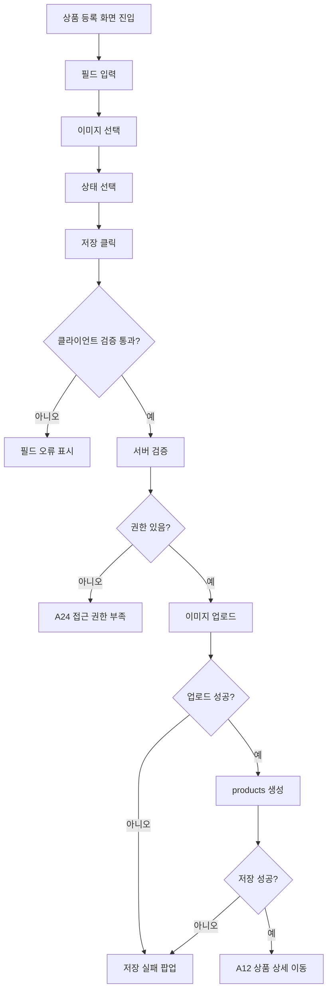

# A11. 상품 등록 화면 정의서

> 문서 버전: `v1.0`  
> 작성일: `2026-07-26`  
> 화면 ID: `A11_Admin_Product_Create_Screen`  
> 화면명: 상품 등록  
> 적용 범위: 캐치캐쉬 관리자 CMS MVP  
> 관련 화면: `A10_Admin_Product_List_Screen`, `A12_Admin_Product_Detail_Screen`, `A13_Admin_Mapping_List_Screen`, `A14_Admin_Mapping_Edit_Screen`  
> 작성 목적: 바이브코딩을 위한 화면 단위 구현 명세

---

# 1. 화면 개요

상품 등록 화면은 운영자가 캐치캐쉬에서 보물상자에 연결할 상품 정보를 신규 등록하는 관리자 CMS 화면이다.

상품은 실제 쿠폰 발급에 필요한 외부 상품 ID와 사용자에게 보여줄 상품명, 브랜드, 가격, 이미지, 상태값을 관리한다.

중요:

```txt
이 화면은 상품 정보를 등록하는 화면이다.
보물상자와 상품을 연결하는 화면이 아니다.
보물-상품 연결은 A14 매칭 등록·교체 화면에서 처리한다.
이 화면에서는 기프티쇼비즈 API를 직접 호출하지 않는다.
쿠폰 번호와 바코드는 등록하지 않는다.
```

---

# 2. 화면 목적

## 2.1 관리자 관점 목적

- 신규 상품 정보를 등록한다.
- 상품명, 브랜드, 설명, 판매가를 입력한다.
- 상품 이미지를 업로드한다.
- 기프티쇼비즈 외부 상품 ID를 저장한다.
- 상품 상태를 `active` 또는 `inactive`으로 지정한다.
- 등록 완료 후 상품 상세 화면으로 이동한다.

## 2.2 시스템 관점 목적

- `products` 테이블에 신규 상품 레코드를 생성한다.
- 상품 이미지는 Supabase Storage에 저장한다.
- 외부 상품 ID는 향후 서버 발급 함수에서 사용 가능한 값으로 보관한다.
- 상품 상태에 따라 매칭 가능 여부를 제어한다.

---

# 3. 진입 조건

## 3.1 진입 경로

| 이전 화면 | 진입 액션 |
|---|---|
| A10 상품 목록 | `상품 등록` 클릭 |
| A13 매칭 목록 | 상품이 없는 경우 상품 등록 링크 클릭 가능 |
| A14 매칭 등록·교체 | 상품 등록 필요 시 별도 링크로 이동 가능 |

## 3.2 접근 권한

| 역할 | 접근 가능 여부 | 설명 |
|---|---:|---|
| super_admin | O | 상품 등록 가능 |
| operator | O | 상품 등록 가능 |
| viewer | X | 조회 전용이므로 접근 불가 |

viewer가 직접 URL로 접근하면 `A24_Admin_Access_Denied_Screen`으로 이동한다.

---

# 4. Route

권장 Route:

```txt
/admin/products/new
```

Next.js App Router 권장 파일 경로:

```txt
app/admin/(protected)/products/new/page.tsx
```

---

# 5. 화면 구조

와이어프레임 기준 화면 구조는 아래 순서로 구성한다.

```txt
AdminLayout
→ 상단 헤더
→ 좌측 사이드바
→ 상품 등록 본문
   → 기본 정보 섹션
   → 상품 이미지 섹션
   → 외부 연동 정보 섹션
   → 상태 설정 섹션
   → 하단 액션 버튼
→ 저장 실패 팝업
```

---

# 6. 레이아웃 정의

## 6.1 전체 레이아웃

```txt
┌──────────────────────────────────────────────┐
│ 캐치캐쉬 CMS                [검색] 권한 [계정] │
├──────────────┬───────────────────────────────┤
│ Sidebar      │ 상품 등록                  목록으로 │
│              │                               │
│              │ [기본 정보]                    │
│              │ 브랜드명 / 상품명               │
│              │ 상품 설명                       │
│              │ 판매 가격                       │
│              │                               │
│              │ [상품 이미지]                  │
│              │ 이미지 미리보기 / 업로드          │
│              │                               │
│              │ [외부 연동 정보]                │
│              │ 기프티쇼비즈 상품 ID             │
│              │                               │
│              │ [상태 설정]                    │
│              │ active / inactive               │
│              │                               │
│              │                    [취소] [저장] │
└──────────────┴───────────────────────────────┘
```

## 6.2 본문 폭

| 항목 | 기준 |
|---|---:|
| 콘텐츠 최대 폭 | 960px ~ 1080px |
| 카드 간격 | 16px |
| 카드 내부 여백 | 20px ~ 24px |
| 입력 높이 | 36px ~ 44px |
| textarea 높이 | 96px 이상 |
| 이미지 업로드 영역 높이 | 180px ~ 240px |

---

# 7. UI 구성 요소

## 7.1 상단 헤더

AdminLayout 공통 헤더를 사용한다.

| 요소 | 설명 |
|---|---|
| 좌측 로고 | `캐치캐쉬 CMS` |
| 검색 입력 | 관리자 공통 검색 영역 |
| 권한 표시 | 현재 관리자 role 표시 |
| 계정 아바타 | 관리자 계정 메뉴 |

---

## 7.2 사이드바

현재 메뉴 `상품`을 활성 상태로 표시한다.

| 메뉴 | 표시 여부 |
|---|---|
| 대시보드 | O |
| 보물상자 | O |
| 상품 | O, active |
| 매칭 | O |
| 보상 | O |
| 유저 | O |
| 문의 | O |
| 운영 로그 | super_admin/operator |
| 보안 로그 | super_admin |
| 관리자 | super_admin |

---

## 7.3 페이지 헤더

| 요소 | 내용 | 동작 |
|---|---|---|
| 페이지 제목 | `상품 등록` | 코드 텍스트 |
| 목록으로 링크 | `상품 목록으로` | `/admin/products` 이동 |

---

# 8. 입력 섹션 정의

## 8.1 기본 정보 섹션

### 구성

```txt
기본 정보
→ 브랜드명
→ 상품명
→ 상품 설명
→ 판매 가격(원)
```

### 필드 정의

| 필드 | 키 | 타입 | 필수 | 검증 |
|---|---|---|---:|---|
| 브랜드명 | `brand_name` | text | O | 1~50자 |
| 상품명 | `product_name` | text | O | 1~100자 |
| 상품 설명 | `description` | textarea | 선택 | 0~500자 |
| 판매 가격 | `price` | number | O | 0 이상의 정수 |

### 입력 정책

```txt
브랜드명과 상품명은 사용자 앱 보상 카드와 보관함에 노출될 수 있다.
판매 가격은 관리자 참고용이며 실제 결제 기능과 연결하지 않는다.
가격은 원화 기준 정수로 저장한다.
```

---

## 8.2 상품 이미지 섹션

### 구성

```txt
상품 이미지
→ 이미지 미리보기 영역
→ 이미지 업로드 버튼
→ 파일 형식/용량 안내
```

### 파일 정책

| 항목 | 기준 |
|---|---|
| 허용 확장자 | JPG, PNG, WebP |
| 최대 용량 | 5MB |
| 저장 위치 | Supabase Storage |
| 권장 비율 | 정사각형 또는 4:3 |
| 이미지 없을 때 | fallback 이미지 또는 빈 이미지 박스 |

### 구현 정책

```txt
업로드 전에는 브라우저에서 미리보기를 표시한다.
저장 버튼 클릭 시 상품 정보 저장과 이미지 업로드를 함께 처리한다.
이미지 업로드 실패 시 상품 등록 전체를 실패 처리한다.
이미지 URL은 products.image_url에 저장한다.
```

---

## 8.3 외부 연동 정보 섹션

### 구성

```txt
외부 연동 정보
→ 기프티쇼비즈 상품 ID(provider_product_id)
→ 안내 문구
```

### 필드 정의

| 필드 | 키 | 타입 | 필수 | 검증 |
|---|---|---|---:|---|
| 기프티쇼비즈 상품 ID | `provider_product_id` | text | O | 1~100자, 중복 불가 권장 |

### 안내 문구

```txt
active 상태로 저장하려면 필수 입력 항목입니다.
```

### 정책

```txt
provider_product_id는 실제 쿠폰 발급 시 서버 발급 함수에서 사용하는 외부 상품 식별자다.
CMS 브라우저에서 기프티쇼비즈 API를 직접 호출하지 않는다.
Client Secret 또는 API Key를 브라우저에 노출하지 않는다.
```

---

## 8.4 상태 설정 섹션

### 구성

```txt
상태 설정
→ 상태 Select
→ 안내 문구
```

### 상태값

| 값 | 라벨 | 의미 |
|---|---|---|
| active | active | 매칭 가능한 활성 상품 |
| inactive | inactive | 매칭 불가 또는 운영 중지 상품 |

### 기본값

```txt
inactive
```

### active 저장 조건

상품을 `active`로 저장하려면 아래 조건을 충족해야 한다.

```txt
상품명 존재
브랜드명 존재
판매 가격 존재
기프티쇼비즈 상품 ID 존재
상품 이미지 존재 권장
```

상품 이미지가 MVP에서 필수인지 선택인지 최종 정책에 따라 다를 수 있다. 현재 와이어프레임 기준으로는 업로드 UI가 있으므로 필수에 가깝게 운영하는 것을 권장한다.

---

# 9. 버튼 정의

## 9.1 취소 버튼

| 항목 | 내용 |
|---|---|
| 라벨 | `취소` |
| 위치 | 우측 하단 |
| 동작 | 상품 목록 또는 이전 화면으로 이동 |
| 확인 팝업 | 입력값 변경 후 취소 시 이탈 확인 권장 |

## 9.2 저장 버튼

| 항목 | 내용 |
|---|---|
| 라벨 | `저장` |
| 위치 | 우측 하단 |
| 권한 | super_admin, operator |
| 동작 | 입력값 검증 후 상품 생성 |
| 로딩 | 저장 중 disabled 처리 |
| 성공 | A12 상품 상세 화면으로 이동 |
| 실패 | 저장 실패 팝업 표시 |

---

# 10. 저장 처리 플로우



---

# 11. 저장 실패 팝업

와이어프레임 기준 저장 실패 팝업을 포함한다.

## 11.1 표시 조건

```txt
필수 항목 누락
서버 저장 실패
이미지 업로드 실패
provider_product_id 중복
권한 부족
네트워크 오류
```

## 11.2 팝업 구성

```txt
타이틀: 저장 실패
본문: 필수 항목을 확인하거나 다시 시도해 주세요.
버튼: 확인
```

## 11.3 동작

| 액션 | 처리 |
|---|---|
| 확인 클릭 | 팝업 닫기 |
| 배경 클릭 | 닫힘 여부는 Dialog 공통 정책 적용 |
| Esc | 닫힘 가능 |

권한 부족인 경우 단순 팝업 대신 `A24_Admin_Access_Denied_Screen`으로 이동한다.

---

# 12. 유효성 검증

## 12.1 클라이언트 검증

```ts
type ProductCreateForm = {
  brand_name: string;
  product_name: string;
  description?: string;
  price: number;
  image_file?: File;
  provider_product_id: string;
  status: 'active' | 'inactive';
};
```

## 12.2 검증 규칙

| 필드 | 오류 조건 | 오류 메시지 예시 |
|---|---|---|
| 브랜드명 | 비어 있음 | 브랜드명을 입력하세요. |
| 상품명 | 비어 있음 | 상품명을 입력하세요. |
| 상품 설명 | 500자 초과 | 상품 설명은 500자 이하로 입력하세요. |
| 판매 가격 | 비어 있음 또는 음수 | 판매 가격을 올바르게 입력하세요. |
| 이미지 | 형식 불일치 | JPG, PNG, WebP 파일만 업로드할 수 있습니다. |
| 이미지 | 5MB 초과 | 5MB 이하 파일만 업로드할 수 있습니다. |
| 외부 상품 ID | 비어 있음 | 기프티쇼비즈 상품 ID를 입력하세요. |
| 상태 | 값 없음 | 상태를 선택하세요. |

---

# 13. 데이터 모델 매핑

## 13.1 products

| 화면 필드 | DB 필드 | 설명 |
|---|---|---|
| 브랜드명 | `brand_name` | 상품 브랜드 |
| 상품명 | `name` | 상품명 |
| 상품 설명 | `description` | 상품 설명 |
| 판매 가격 | `price` | 원화 가격 |
| 상품 이미지 | `image_url` | Storage 파일 URL |
| 외부 상품 ID | `provider_product_id` | 기프티쇼비즈 상품 ID |
| 상태 | `status` | active/inactive |
| 등록일 | `created_at` | 서버 생성 |
| 수정일 | `updated_at` | 서버 갱신 |
| 등록자 | `created_by` | 현재 관리자 ID |
| 수정자 | `updated_by` | 현재 관리자 ID |

## 13.2 저장 요청 예시

```ts
type CreateProductRequest = {
  brand_name: string;
  name: string;
  description?: string;
  price: number;
  image_url?: string;
  provider_product_id: string;
  status: 'active' | 'inactive';
};
```

---

# 14. 권한 정책

## 14.1 화면 접근

```txt
super_admin: 접근 가능, 저장 가능
operator: 접근 가능, 저장 가능
viewer: 접근 불가
```

## 14.2 서버 검증

UI에서 버튼을 숨기는 것과 별개로 서버에서도 다음을 검증한다.

```txt
현재 세션이 관리자 세션인지 확인
admin_profiles.role이 super_admin 또는 operator인지 확인
admin_profiles.status가 active인지 확인
```

---

# 15. 보안 정책

```txt
SUPABASE_SERVICE_ROLE_KEY는 브라우저에 노출하지 않는다.
기프티쇼비즈 Client Secret은 브라우저에 노출하지 않는다.
CMS는 쿠폰 번호와 바코드를 입력받지 않는다.
provider_product_id만 저장한다.
상품 등록 시 민감 정보는 저장하지 않는다.
이미지 업로드 경로는 서버 정책에 따라 제한한다.
```

---

# 16. 이 화면에서 하지 않는 것

```txt
보물상자 등록
보물-상품 매칭
쿠폰 발급
쿠폰 번호 입력
바코드 입력
기프티쇼비즈 API 직접 호출
상품 API 자동 동기화
상품별 재고 관리
상품별 지급 수량 관리
랜덤 지급/확률 지급 설정
```

---

# 17. 상태별 화면 처리

| 상태 | 화면 처리 |
|---|---|
| 초기 | 빈 폼 표시 |
| 입력 중 | form state 갱신 |
| 이미지 선택 | 미리보기 표시 |
| 저장 중 | 저장 버튼 disabled, 로딩 표시 |
| 저장 성공 | A12 상품 상세 이동 |
| 저장 실패 | 저장 실패 팝업 표시 |
| 권한 없음 | A24 접근 권한 부족 이동 |

---

# 18. QA 체크리스트

## 18.1 화면 표시

- [ ] 상품 등록 화면 제목이 표시된다.
- [ ] 상품 목록으로 링크가 표시된다.
- [ ] 기본 정보 섹션이 표시된다.
- [ ] 상품 이미지 섹션이 표시된다.
- [ ] 외부 연동 정보 섹션이 표시된다.
- [ ] 상태 설정 섹션이 표시된다.
- [ ] 취소/저장 버튼이 표시된다.

## 18.2 입력 검증

- [ ] 브랜드명 미입력 시 저장되지 않는다.
- [ ] 상품명 미입력 시 저장되지 않는다.
- [ ] 판매 가격 미입력 시 저장되지 않는다.
- [ ] 판매 가격 음수 입력 시 저장되지 않는다.
- [ ] 외부 상품 ID 미입력 시 저장되지 않는다.
- [ ] 허용되지 않은 이미지 형식 업로드 시 오류가 표시된다.
- [ ] 5MB 초과 이미지 업로드 시 오류가 표시된다.

## 18.3 저장 처리

- [ ] 저장 클릭 시 로딩 상태가 표시된다.
- [ ] 저장 중 버튼이 중복 클릭되지 않는다.
- [ ] 저장 성공 시 상품 상세 화면으로 이동한다.
- [ ] 저장 실패 시 저장 실패 팝업이 표시된다.
- [ ] 확인 클릭 시 저장 실패 팝업이 닫힌다.

## 18.4 권한

- [ ] super_admin은 상품 등록 가능하다.
- [ ] operator는 상품 등록 가능하다.
- [ ] viewer는 직접 URL 접근 시 A24로 이동한다.
- [ ] 서버에서도 viewer 저장 요청이 차단된다.

## 18.5 보안

- [ ] 쿠폰 번호 입력 필드가 없다.
- [ ] 바코드 입력 필드가 없다.
- [ ] 기프티쇼비즈 Secret 입력 필드가 없다.
- [ ] 브라우저 응답에 민감 키가 포함되지 않는다.

---

# 19. 개발 메모

```txt
상품 등록과 상품 매칭은 분리한다.
상품 등록 후 바로 보물에 연결하지 않는다.
등록 성공 후 A12 상세로 이동하고, 필요 시 A14 매칭 관리에서 연결한다.
active 상품만 매칭 대상으로 노출한다.
inactive 상품은 기존 연결 요약에는 표시될 수 있으나 신규 매칭 후보에서는 제외한다.
```
